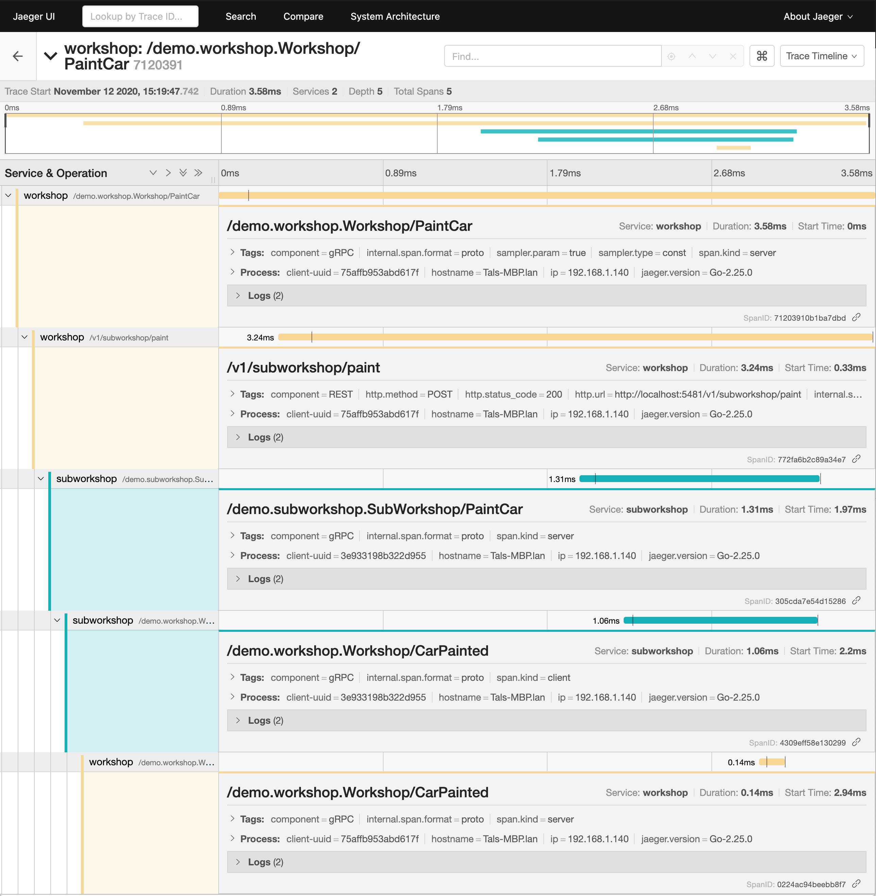

# Mortar Demo

There are 2 services in this repository, clone it and follow the instructions on how to run it below.  

## Running the demo

### Docker

Before you run either Workshop/Sub Workshop services it is advised to run **docker-compose** first.

> Open a shell, change directory to `mortar-demo/docker` now run the following
```shell script
docker-compose up
``` 

This should bring up the following services

* [Prometheus](http://localhost:9090) 
* [Jaeger](http://localhost:16686)
* [Grafana](http://localhost:3000)

### Workshop/Sub Workshop

* Workshop
    > Open a shell, change your directory to `mortar-demo/workshop` and run the following
    ```shell script
    make run
    ```

* Sub Workshop
    > Open a shell, change your directory to `mortar-demo/subworkshop` and run the following
    ```shell script
    make run
    ```

Now you should have Workshop and Sub Workshop services running. It's time to execute different HTTP calls.

### HTTP Calls to Workshop service **http://localhost:5381/v1/workshop**

* Register a new car
    ```shell script
    curl -X "POST" "http://localhost:5381/v1/workshop/cars" \
      -H 'Content-Type: application/json; charset=utf-8' \
      -d $'{
    "number": "ABCD4248",
    "owner": "Mr. Smith",
    "body_style": "SEDAN",
    "color": "red"
    }'
    ```

* Paint `ABCD4248` Car
    ```shell script
    curl -X "PUT" "http://localhost:5381/v1/workshop/cars/ABCD4248/paint" \
         -H 'Content-Type: application/json; charset=utf-8' \
         -d $'{
      "desired_color": "green"
    }'
    ```
## So what's there to see...

* You can see the logs of each service [Workshop/Sub Workshop] in their respective shells.
    
    > A lot of **implicit** information injected to the log entry [`error`, `git-hash`, `trace-info`, `app`, `host`] 
    ```go
    w.deps.Logger.WithError(err).Debug(ctx, "sending car to be painted") // Line 56
    ```
    
      
* [Jaeger](http://localhost:16686) can show you all the requests you've made including how they traveled if any to a remote services.
    
        
    
* [Prometheus](http://localhost:9090)/[Grafana](http://localhost:3000) can be used to visualise different metrics that are recorded implicitly or explicitly.

    ```go
    counter := w.deps.Metrics.WithTags(monitor.Tags{
            "color": request.GetDesiredColor(),
            "success" : fmt.Sprintf("%t", err == nil),
           }).Counter("paint_desired_color", "New paint color for car")

    counter.Inc()
    ```
    

## Services

### [Workshop](workshop) is used as a "front" to accept cars, requests for paint, etc.

There is one special request which is actually a proxy to Sub Workshop service.
In this case we are calling Sub Workshop using `*http.Client` a.k.a REST.
This request really shows how different middleware/interceptors help you achieve great visibility.

* Open-Tracing is used to report how request is traveling between different services
* Logs implicitly inject Trace information, so you can later aggregate all the logs from different services related to a particular request.
* Metrics used to count different application insights (What 'color' is most popular)

All this is achieved mostly **implicitly** by using multiple middleware/interceptors. 

### [Sub Workshop](subworkshop) is here to serve as a remote service call.

This service only accepts one request - `SubPaintCarRequest`.

```protobuf
rpc PaintCar(SubPaintCarRequest) returns (google.protobuf.Empty) {
    option (google.api.http) = {
      post: "/v1/subworkshop/paint"
      body: "*"
    };
}
```

As part of its logic it will **callback** our Workshop service using **gRPC**.

This will complete our request cycle. You can see the entire Trace using [Jaeger UI](http://localhost:16686). 

